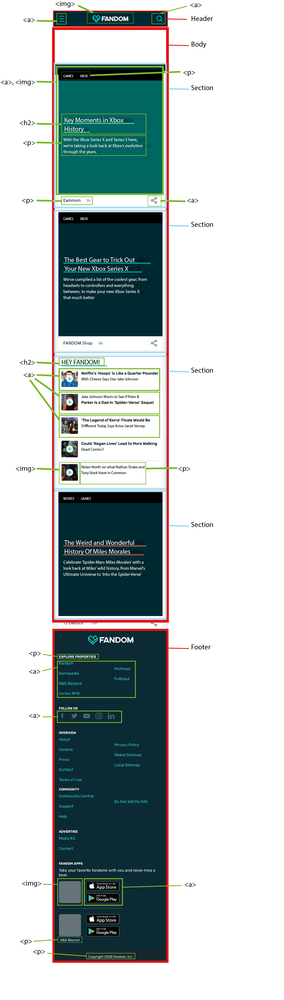
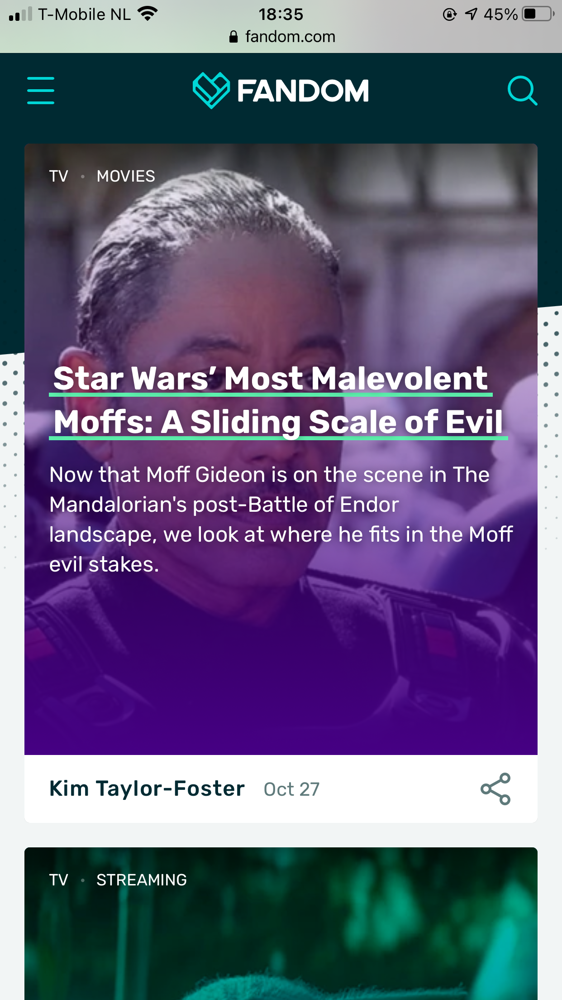
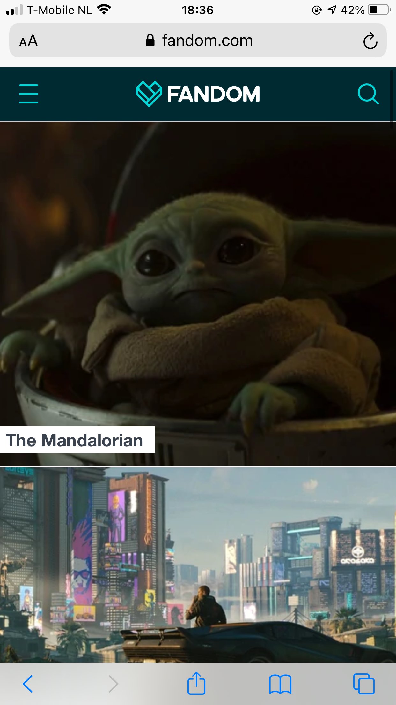

# Procesverslag
**Auteur:** Charlie Jansen Garcia

Markdown cheat cheet: [Hulp bij het schrijven van Markdown](https://github.com/adam-p/markdown-here/wiki/Markdown-Cheatsheet). Nb. de standaardstructuur en de spartaanse opmaak zijn helemaal prima. Het gaat om de inhoud van je procesverslag. Besteedt de tijd voor pracht en praal aan je website.

## Bronnenlijst
1. https://stackoverflow.com/questions/33910294/what-is-the-difference-between-article-and-section-in-html5/33910539
2. https://developer.mozilla.org/nl/docs/Learn/HTML/Forms/How_to_structure_an_HTML_form
3. -...-

## Bronnenlijst voor afbeeldingen
1. https://vignette.wikia.nocookie.net/51fe011d-e97c-43c4-a745-df5ac51f5740/scale-to-width-down/800
2. https://vignette.wikia.nocookie.net/fb0200cc-b1e6-45f5-8fc7-e672c6f62dcf/scale-to-width-down/800
3. https://vignette.wikia.nocookie.net/1869ec13-f1d6-46f9-a759-653c49792ef9/scale-to-width-down/800
4. https://vignette.wikia.nocookie.net/8c76662c-4eb7-4eae-ac36-c5763c304f21/scale-to-width-down/800

## Eindgesprek (week 7/8)

-dit ging goed & dit was lastig-

**Screenshot(s):**

-screenshot(s) van je eindresultaat-

## Voortgang 3 (week 6)

-same as voortgang 1-

## Voortgang 2 (week 5)

-same as voortgang 1-

## Voortgang 1 (week 3)

### Stand van zaken

Op 21 en 22 november was ik vooral bezig om de html van de site op te zetten. Dit ging zonder al te veel problemen, dus ik heb meteen op zondagavond (de 22ste dus) mijn code op Github gezet.
Verder heb ik tijdens het coderen vooral dingen uitgeprobeerd in plaats van alles zo uitgebreid mogelijk te maken, dus ik heb bijvoorbeeld nog maar 1 artikel van het thuisscherm gecodeerd. Later ga ik dit artikel vormgeven met css en dan kan ik die code copy-pasten voor alle andere artikelen.

Op de 23ste ben ik begonnen met de css en afbeeldingen van mijn site. Zo heb ik de achtergrond toegevoegd, de afbeelding van het eerste artikel erin gezet en de header en footer meer vormgegeven.

--planning--

Op de 24ste heb ik de vormgeving afgemaakt. Ik heb ook al een begin gemaakt aan de tweede pagina.

**Screenshot(s):**

-screenshot(s) van hoe ver je bent met korte uitleg-

### Agenda voor meeting

-samen met je groepje opstellen-

| student 1      | student 2          | student 3    | student 4        |
| ---            | ---                | ---          | ---              |
| dit bespreken  | en dit             | en ik dit    | en dan ik dat    |
| an dat ook nog | dit als er tijd is | nog een punt | dit wil ik zeker |
| ...            | ...                | ...          | ...              |

### Verslag van meeting

-na afloop snel uitkomsten vastleggen-

## Breakdownschets (week 1)

## Intake (week 1)

**Je startniveau:** Rood

**Je focus:** Extra aandacht voor de surface laag

**Je opdracht:** https://www.fandom.com/

**Screenshot(s) van de eerste pagina (small screen):**

**Screenshot(s) van de tweede pagina (small screen):**

**Screenshot(s) van de tweede (extra) pagina (small screen):**

