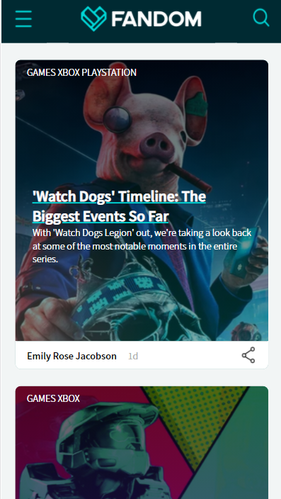
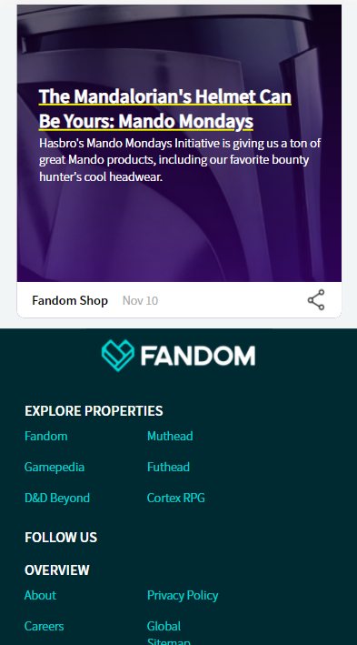
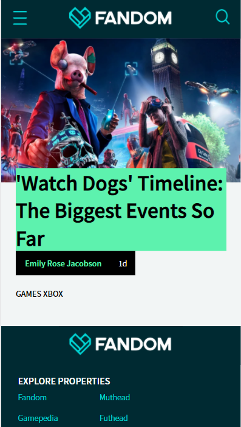

# Procesverslag
**Auteur:** Charlie Jansen Garcia

Markdown cheat cheet: [Hulp bij het schrijven van Markdown](https://github.com/adam-p/markdown-here/wiki/Markdown-Cheatsheet). Nb. de standaardstructuur en de spartaanse opmaak zijn helemaal prima. Het gaat om de inhoud van je procesverslag. Besteedt de tijd voor pracht en praal aan je website.

## Bronnenlijst
1. https://stackoverflow.com/questions/33910294/what-is-the-difference-between-article-and-section-in-html5/33910539
2. https://developer.mozilla.org/nl/docs/Learn/HTML/Forms/How_to_structure_an_HTML_form
3. https://codepen.io/JacobLett/pen/dOYxJb

## Bronnenlijst voor afbeeldingen
1. https://vignette.wikia.nocookie.net/51fe011d-e97c-43c4-a745-df5ac51f5740/scale-to-width-down/800
2. https://vignette.wikia.nocookie.net/fb0200cc-b1e6-45f5-8fc7-e672c6f62dcf/scale-to-width-down/800
3. https://vignette.wikia.nocookie.net/1869ec13-f1d6-46f9-a759-653c49792ef9/scale-to-width-down/800
4. https://vignette.wikia.nocookie.net/8c76662c-4eb7-4eae-ac36-c5763c304f21/scale-to-width-down/800

## Eindgesprek (week 7/8)

-dit ging goed & dit was lastig-

**Screenshot(s):**

-screenshot(s) van je eindresultaat-

## Voortgang 3 (week 6)

-same as voortgang 1-

## Voortgang 2 (week 5)

Op 6 december ben ik weer verder gegaan met mijn site. Ik heb een week ervoor geleerd hoe ik een hamburgermenu met een animatie op mijn site kan zetten. Dit lijkt me leuk om te doen en gebruikt ook meteen Javascript zodat ik tenminste aan alle minimale eisen voldoe. Ik ga vandaag dus alvast kijken naar hoe ik dit zal moeten regelen en waarschijnlijk ga ik er morgen mee aan de slag. Voor vandaag ga ik de overige afbeeldingen (zoals die van de social media icoontjes) nog invoegen en de rest van de 2de pagina zo ver mogelijk proberen af te maken.

Op 8 december heb ik het hamburgermenu met behulp van Martijn met een animatie aan mijn site toegevoegd en heb ik de site alvast online gezet om te checken of alles nog goed werkte. Verder heb ik ook nog eindelijk de comments toegevoegd en heb ik alvast gekeken naar hoe ik mijn classes het beste in nth-of-type's kan veranderen.

Op 9 december heb ik alvast een gedeelte van de classes veranderd in nth-of-type's, heb ik de 2de pagina afgemaakt en heb ik de w3c validator gebruikt om mijn code te controleren. De laatste versie heb ik online gezet voor het voortgangsgesprek.

Ik heb nog problemen met een aantal dingen (op 9 december):

- Op de article info pagina moet de markering alleen over de tekst en niet in het hele blok.
- In mijn footer worden de linkjes niet meer links uitgelijnd nadat ik de classes heb verwijderd.
- Ik kan de button niet stylen om hem op de rest van de navbar te laten lijken.

## Voortgang 1 (week 3)

### Stand van zaken

Op 21 en 22 november was ik vooral bezig om de html van de site op te zetten. Dit ging zonder al te veel problemen, dus ik heb meteen op zondagavond (de 22ste dus) mijn code op Github gezet.
Verder heb ik tijdens het coderen vooral dingen uitgeprobeerd in plaats van alles zo uitgebreid mogelijk te maken, dus ik heb bijvoorbeeld nog maar 1 artikel van het thuisscherm gecodeerd. Later ga ik dit artikel vormgeven met css en dan kan ik die code copy-pasten voor alle andere artikelen.

Op de 23ste ben ik begonnen met de css en afbeeldingen van mijn site. Zo heb ik de achtergrondkleur toegevoegd, de afbeelding van het eerste artikel erin gezet en de header en footer meer vormgegeven.

Op de 24ste heb ik de vormgeving van de homepage afgemaakt. Ik heb ook al een begin gemaakt aan de tweede pagina. Verder moet ik ook nog details toevoegen zoals social media icoontjes, images van de app en play store invoegen, de background image erin zetten en de ruimte tussen de tags groter maken met een stip ertussen. Deze details zal ik pas na het voortgangsgesprek doen. Verder zal ik kijken of het vullen van de artikel-pagina nog lukt voor het gesprek, maar mocht dit niet zo zijn dan zal ik er niet veel moeite mee hebben aangezien het elke keer een stukje tekst met afbeelding is.

Iets dat ik over het hoofd had gezien (en ik wist ook niet dat het überhaupt bestond) was het zoom-niveau in mijn browser om de output van mijn code te bekijken. Hierdoor heb ik met het verkeerde aantal pixels zitten werken. Maar ipv mijn hele code te veranderen heb ik de initial scale aangepast. Ik zal dus nog even moeten vragen of dat wel mag, anders zit ik nu in een lastige situatie :/

Het laatste waar ik mee zit is de background image. Ze gebruiken op de site een schuin vlak en daaronder vandaan komen veel stippen die van groot naar klein gaan. Ik heb alvast gekeken naar hoe ik die stippen zou kunnen doen, maar heb nog geen oplossing gevonden...

Extra probleempje waar ik 25 november achter ben gekomen is dat de w3c validator errors geeft over mijn body en footer tags. Hij geeft aan dat mijn body al is geopend (dat is niet zo) en dat mijn footer een 'stray start tag' is. Later op de dag heb ik hulp gekregen van mijn medestudenten. Ik had de main en body tags helemaal door elkaar gehaald. Kleine vergissing dus, maar dit probleem is opgelost.

**Screenshot(s):**

De homepage is (op een paar details na) helemaal af. De tags die bovenaan de afbeeldingen staan moeten meer uit elkaar (door er verschillende elementen van te maken), images van social media en de app/play store moeten nog toegevoegd worden en er moet nog een background-image komen.
Ik ben nu ongeveer op 90%.

Het ziet er nu nog uit als heel weinig, maar eigenlijk moet ik hier alleen nog maar content en afbeeldingen invoegen. Er is elke keer een stukje tekst en daarna een horizontale afbeelding. Daarna weer een stukje tekst en afbeelding enz... Ook moeten hier ook nog de afbeeldingen van de footer worden toegevoegd (dus de social media icoontjes en de app/play store images).
Ik ben nu ongeveer op 80%.

### Agenda voor meeting

| Emma | Jon | Charlie | Nine | Martijn |
| --- | --- | --- | --- | --- |
| Waarop letten bij responsive | w3c validator | w3c validator | w3c validator | :nth-of-type |
| font probleem | header probleem | ... | background-image | ... |
| w3c validator | ... | ... | ... | ... |

### Verslag van meeting

Ik zou de achtergrondafbeelding kunnen faken met een rechthoek dat ik schuin plaats en dat een afbeelding daaronder met de stippen. Dit is waarschijnlijk ook wel wat ik ga doen aangezien de stippen een stuk code zouden moeten zijn wat wij nog nooit hebben geleerd en wat een stuk geavanceerder is dan wat ik gewend ben. Nog steeds zou het plaatsen van de rechthoek wel een uitdaging zijn en goed aansluiten op de opdrachten die we voor dit vak moesten maken.

## Breakdownschets (week 1)

## Intake (week 1)

**Je startniveau:** Rood

**Je focus:** Extra aandacht voor de surface laag

**Je opdracht:** https://www.fandom.com/

**Screenshot(s) van de eerste pagina (small screen):**

**Screenshot(s) van de tweede pagina (small screen):**

**Screenshot(s) van de tweede (extra) pagina (small screen):**

