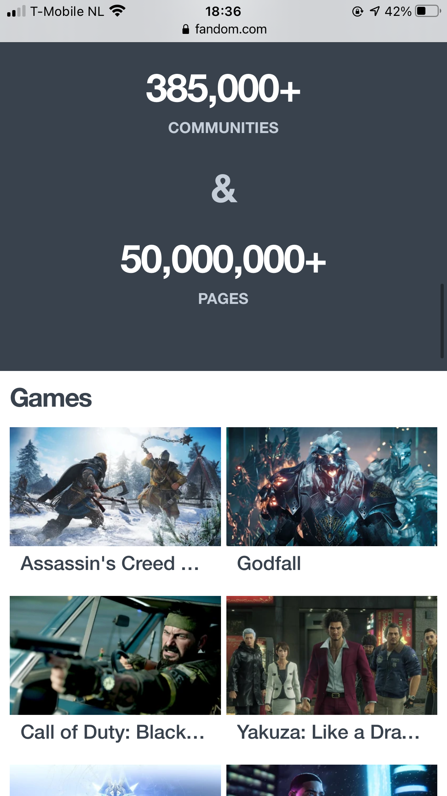

# Procesverslag
**Auteur:** Charlie Jansen Garcia

Markdown cheat cheet: [Hulp bij het schrijven van Markdown](https://github.com/adam-p/markdown-here/wiki/Markdown-Cheatsheet). Nb. de standaardstructuur en de spartaanse opmaak zijn helemaal prima. Het gaat om de inhoud van je procesverslag. Besteedt de tijd voor pracht en praal aan je website.

## Bronnenlijst
1. https://stackoverflow.com/questions/33910294/what-is-the-difference-between-article-and-section-in-html5/33910539
2. https://developer.mozilla.org/nl/docs/Learn/HTML/Forms/How_to_structure_an_HTML_form
3. https://codepen.io/JacobLett/pen/dOYxJb
4. https://stackoverflow.com/questions/35866765/how-to-change-the-default-button-border-using-css
5. https://www.youtube.com/watch?v=5Ox6NisURis
6. https://stackoverflow.com/questions/336925/custom-cursor-image-css

## Bronnenlijst voor afbeeldingen
1. https://vignette.wikia.nocookie.net/51fe011d-e97c-43c4-a745-df5ac51f5740/scale-to-width-down/800
2. https://vignette.wikia.nocookie.net/fb0200cc-b1e6-45f5-8fc7-e672c6f62dcf/scale-to-width-down/800
3. https://vignette.wikia.nocookie.net/1869ec13-f1d6-46f9-a759-653c49792ef9/scale-to-width-down/800
4. https://vignette.wikia.nocookie.net/8c76662c-4eb7-4eae-ac36-c5763c304f21/scale-to-width-down/800

## Eindgesprek (week 7/8)

Op 30 december ben ik eindelijk weer verder gegaan met de site. Ik heb de Pizza-cursor toegevoegd wanneer de gebruiker over een link hovert en heb de rest van de a'tjes in mijn code een link meegegeven. Ook de achtergrondafbeelding is toegevoegd. Het enige probleempje wat ik vandaag heb gehad was dat de custom cursor niet door alle browsers ondersteund wordt, bijvoorbeeld Firefox. En je ziet de cursor niet als je de browser op een telefoonformaat zet. Dit is namelijk omdat de browser dan ook gelijk "touch controls" wilt nabootsen, terwijl ik dat in dit geval niet wil. De custom cursor is dus (tot zover ik weet) helaas alleen te zien als de browser in een pc formaat is.

Op 31 december heb ik de images in de footer uit elkaar gehaald en verschillende elementen meegegeven met classes. Ook heb ik het toegankelijkheid verslag ingevuld en heb ik het beoordelingsformulier bekeken zodat ik niets over het hoofd heb gezien.

Op 2 januari heb ik de site beperkt responsive gemaakt voor landscape mode. Daarnaast heb ik de vormgeving van de 2de pagina afgemaakt. Ik moet nu dus alleen nog maar 2 animaties toevoegen en kijken of ik nog wat details (in zowel mijn code als de site) kan verbeteren.

Update van 4 januari:
Ik heb veel meer bugfixes moeten doen dan verwacht. Hierdoor werden de dingen die ik nog moest doen voor de site zoals bijvoorbeeld de animaties steeds verder verzet. De bugs waren namelijk nog overal. Van het zoekbalkje dat opeens door de header kwam als ik de header een position:sticky meegaf tot images die niet goed wilden scalen tot linkjes die uit het niets de goede styling niet meer hadden. Ik heb de afgelopen 2 dagen dus vooral dat soort bugs zitten fixen en nog steeds zitten er een paar in. Het probleem is dat ik nu tijd te kort kom om die bugs nog te fixen. Ik ga me vanaf nu dus nog focussen op de 2 animaties die ik moet toevoegen. Verder zal ik ervoor zorgen dat alles tenminste werkt zodat ik aan de minimale eisen voldoe.

Update van 6 januari (laatste dag):
Ik heb de afgelopen 2 dagen vooral met veel irritatie zitten coderen. Grotendeels omdat veel dingen niet lukten terwijl dat eerst wel zo was, maar ook omdat ik wanneer ik iets eindelijk had gefixt er wel weer een ander probleem kwam dat er niets mee te maken had (bijvoorbeeld header een sticky position geven en dat opeens het zoekbalkje eronder vandaan komt terwijl ik al z-index heb meegegeven). Ook last-minute kwamen er opeens weer dingen bij. 2 dagen geleden werkte mijn custom cursor nog op elke browser behalve Firefox. Nu (op woensdag 13:50 uur) werkt mijn custom cursor opeens nergens meer, behalve mijn eigen laptop. Ik ben niet echt blij met het eindproduct omdat er op het eind opeens zoveel misging terwijl ik het hele vak niet al te veel problemen had. Toch lever ik het natuurlijk wel in en we zullen zien.

**Screenshot(s):**

Dingen die ik graag nog had willen fixen maar waar ik geen tijd meer voor had
- Firefox bugs - Ik heb op internet gekeken wat er allemaal voor zorgde dat ik zoveel bugs had in Firefox, maar helaas heb ik niet voor alles iets kunnen vinden. Vooral op de tweede pagina gaan er een paar dingen fout. De lettergrootte is op de tweede pagina heel raar, terwijl het bij alle andere browsers wel goed werkt. Ook de custom cursor is op Firefox niet te zien, maar na een beetje onderzoek ben ik erachter gekomen dat custom cursors in Firefox moeilijker zijn om te activeren. EDIT: Last-minute werkt mijn custom cursor helemaal niet meer als ik mijn site upload, maar nog wel op mijn laptop...
- Uitlijning van sommige elementen, vooral de p's van hoe lang geleden een artikel is gepost. Soms staan ze opeens heel anders in de section waarin ze zitten, maar wanneer je de pagina opnieuw laadt is het opeens weer gefixt. Meestal tenminste...
- Ik wilde eerst een animatie doen met social media icoontjes die vanaf de zijkant van het scherm naar binnen scrollen als de gebruiker op de share button klikt. Ik had mijn Javascript code hiervoor precies hetzelfde als de code die ik voor het hamburgermenu heb gebruikt en toch wilde het niet werken. Ik heb ipv deze animatie een soort easter egg toegevoegd bij de tweede pagina.

Al met al nog best veel dat uiteindelijk fout is gegaan. Ik heb mijn best gedaan om tenminste de minimale eisen te halen, maar om eerlijk te zijn vind ik het zelf net kantje boord.

## Toegankelijkheid verslag

Toen ik de toegankelijkheid van mijn site ging testen kwam ik achter een paar dingen. Ten eerste: ik vond het navigeren met een screenreader best ongemakkelijk. Sommige delen worden heel snel uitgesproken en andere delen weer heel snel. Dit gaf me ook inzicht in waarom ik bijvoorbeeld de alt-teksten duidelijk moet maken. Ten tweede: sommige delen van mijn site waren nog niet te bereiken met de alt-toets.  Maar aangezien de minimale eis is dat een gebruiker op alle interactieve elementen kan komen met ten minste de alt-toets moet ik dit nog zeker aanpassen. Ten slotte waren sommige alt-teksten nog niet perfect door de woorden die ik heb gebruikt. Zo wordt het woord "image" niet goed uitgesproken met een Nederlandse screen reader. Mocht ik nog tijd hebben op het einde, dan zal ik dat nog aanpassen maar het is geen prioriteit voor me omdat de alt-teksten tenminste wel bestaan.

Na de bevindingen die ik had gedaan ging ik aan de slag met de interactieve elementen zodat de gebruiker met de alt-toets alles op de site kan activeren. Daarnaast heb ik ook een focus state toegevoegd aan de buttons, klikbare images en links. Ik had nog even problemen met het meegeven van styling aan de links in de footer, maar uiteindelijk is dit me wel gelukt.

## Voortgang 3 (week 6)

Ik heb sinds het vorige voortgangsgesprek nog heel weinig gedaan. De enige 2 punten waar ik wel wat aan heb kunnen doen zijn weer de classes die ik wat heb aangepast en het search gedeelte van de site. De animatie werkt nu perfect, maar ik moet de vormgeving ervan nog wat mooier maken.

Voor de rest heb ik nog weinig vragen. Ik weet dat ik wat ik nog moet doen wel mogelijk is maar dat ik er alleen nog tijd in moet steken. In de vakantie zou het dus goed moeten komen.

## Voortgang 2 (week 5)

Op 6 december ben ik weer verder gegaan met mijn site. Ik heb een week ervoor geleerd hoe ik een hamburgermenu met een animatie op mijn site kan zetten. Dit lijkt me leuk om te doen en gebruikt ook meteen Javascript zodat ik tenminste aan alle minimale eisen voldoe. Ik ga vandaag dus alvast kijken naar hoe ik dit zal moeten regelen en waarschijnlijk ga ik er morgen mee aan de slag. Voor vandaag ga ik de overige afbeeldingen (zoals die van de social media icoontjes) nog invoegen en de rest van de 2de pagina zo ver mogelijk proberen af te maken.

Op 8 december heb ik het hamburgermenu met behulp van Martijn met een animatie aan mijn site toegevoegd en heb ik de site alvast online gezet om te checken of alles nog goed werkte. Verder heb ik ook nog eindelijk de comments toegevoegd en heb ik alvast gekeken naar hoe ik mijn classes het beste in nth-of-type's kan veranderen.

Op 9 december heb ik alvast een gedeelte van de classes veranderd in nth-of-type's, heb ik de 2de pagina afgemaakt en heb ik de w3c validator gebruikt om mijn code te controleren. De laatste versie heb ik online gezet voor het voortgangsgesprek.

Ik heb nog problemen met een aantal dingen (op 9 december):

- Op de article info pagina moet de markering alleen over de tekst en niet in het hele blok.
- In mijn footer worden de linkjes niet meer links uitgelijnd nadat ik de classes heb verwijderd.
- Ik kan de button niet stylen om hem op de rest van de navbar te laten lijken.

Na het vragenuurtje van 9 december ben ik weer bezig geweest met de punten waar ik nog problemen had. De styling van de button is me uiteindelijk gelukt en in mijn footer worden de linkjes nu wel links uitgelijnd. Iris gaf als tip dat ik het woord "Far" in mijn h1 van de article info pagina in een apart element zou kunnen plaatsen en die perfect zou moeten uitlijnen om aan te sluiten bij de rest van de titel. Hier ga ik later mee aan de slag aangezien dat best veel extra werk is terwijl ik me eerst op andere delen van de site moet focussen.

**Screenshot(s):**

Om de hele site af te maken moet ik nog doen:

- Social media icoontjes toevoegen bij de article info page
- Kopjes toevoegen bij de article info page
- Images in de footer uit elkaar halen en verschillende a'tjes geven
- De bovenkant van het hamburgermenu afmaken (vlak groter maken of fixed scroll)
- De classes nog uit de main van de homepage halen
- Classes uit de header halen
- Achtergrondafbeelding toevoegen

### Agenda voor meeting

| Emma | Jon | Charlie | Nine | Martijn |
| --- | --- | --- | --- | --- |
| Padding bij Hover | Background-images | Gebruik van classes | ... | ... |
| Animatie | ... | Verwachting bij surface plane | ... | ... |
| ... | ... | ... | ... | ... |

### Verslag van meeting

Uit het gesprek bleek dat ik dus nog steeds classes voor mijn articles op de homepage mag gebruiken, maar dat het er wel om gaat dat ik zoveel mogelijk classes verander in pseudo-paden. Dit is dus niet zo'n groot probleem en eigenlijk wordt het bij dat gedeelte zelfs aangeraden om classes te gebruiken.

Verder werd er aangegeven dat ik helemaal los kan gaan met de microinteracties. Zo gaf Janno als tip dat ik iets met een pizza kan gaan doen. Ik denk dat ik ga proberen om de cursor in een pizza icoontje te veranderen aangezien het me een leuke uitdaging lijkt en de site toch voor wat personalisatie zorgt.

Er worden ongeveer 5 animaties verwacht, waarvan ik er al één heb met het hamburgermenu.

## Voortgang 1 (week 3)

### Stand van zaken

Op 21 en 22 november was ik vooral bezig om de html van de site op te zetten. Dit ging zonder al te veel problemen, dus ik heb meteen op zondagavond (de 22ste dus) mijn code op Github gezet.
Verder heb ik tijdens het coderen vooral dingen uitgeprobeerd in plaats van alles zo uitgebreid mogelijk te maken, dus ik heb bijvoorbeeld nog maar 1 artikel van het thuisscherm gecodeerd. Later ga ik dit artikel vormgeven met css en dan kan ik die code copy-pasten voor alle andere artikelen.

Op de 23ste ben ik begonnen met de css en afbeeldingen van mijn site. Zo heb ik de achtergrondkleur toegevoegd, de afbeelding van het eerste artikel erin gezet en de header en footer meer vormgegeven.

Op de 24ste heb ik de vormgeving van de homepage afgemaakt. Ik heb ook al een begin gemaakt aan de tweede pagina. Verder moet ik ook nog details toevoegen zoals social media icoontjes, images van de app en play store invoegen, de background image erin zetten en de ruimte tussen de tags groter maken met een stip ertussen. Deze details zal ik pas na het voortgangsgesprek doen. Verder zal ik kijken of het vullen van de artikel-pagina nog lukt voor het gesprek, maar mocht dit niet zo zijn dan zal ik er niet veel moeite mee hebben aangezien het elke keer een stukje tekst met afbeelding is.

Iets dat ik over het hoofd had gezien (en ik wist ook niet dat het überhaupt bestond) was het zoom-niveau in mijn browser om de output van mijn code te bekijken. Hierdoor heb ik met het verkeerde aantal pixels zitten werken. Maar ipv mijn hele code te veranderen heb ik de initial scale aangepast. Ik zal dus nog even moeten vragen of dat wel mag, anders zit ik nu in een lastige situatie.

Het laatste waar ik mee zit is de background image. Ze gebruiken op de site een schuin vlak en daaronder vandaan komen veel stippen die van groot naar klein gaan. Ik heb alvast gekeken naar hoe ik die stippen zou kunnen doen, maar heb nog geen oplossing gevonden...

Extra probleempje waar ik 25 november achter ben gekomen is dat de w3c validator errors geeft over mijn body en footer tags. Hij geeft aan dat mijn body al is geopend (dat is niet zo) en dat mijn footer een 'stray start tag' is. Later op de dag heb ik hulp gekregen van mijn medestudenten. Ik had de main en body tags helemaal door elkaar gehaald. Kleine vergissing dus, maar dit probleem is opgelost.

**Screenshot(s):**

De homepage is (op een paar details na) helemaal af. De tags die bovenaan de afbeeldingen staan moeten meer uit elkaar (door er verschillende elementen van te maken), images van social media en de app/play store moeten nog toegevoegd worden en er moet nog een background-image komen.
Ik ben nu ongeveer op 90%.

Het ziet er nu nog uit als heel weinig, maar eigenlijk moet ik hier alleen nog maar content en afbeeldingen invoegen. Er is elke keer een stukje tekst en daarna een horizontale afbeelding. Daarna weer een stukje tekst en afbeelding enz... Ook moeten hier ook nog de afbeeldingen van de footer worden toegevoegd (dus de social media icoontjes en de app/play store images).
Ik ben nu ongeveer op 80%.

### Agenda voor meeting

| Emma | Jon | Charlie | Nine | Martijn |
| --- | --- | --- | --- | --- |
| Waarop letten bij responsive | w3c validator | w3c validator | w3c validator | :nth-of-type |
| font probleem | header probleem | ... | background-image | ... |
| w3c validator | ... | ... | ... | ... |

### Verslag van meeting

Ik zou de achtergrondafbeelding kunnen faken met een rechthoek dat ik schuin plaats en dat een afbeelding daaronder met de stippen. Dit is waarschijnlijk ook wel wat ik ga doen aangezien de stippen een stuk code zouden moeten zijn wat wij nog nooit hebben geleerd en wat een stuk geavanceerder is dan wat ik gewend ben. Nog steeds zou het plaatsen van de rechthoek wel een uitdaging zijn en goed aansluiten op de opdrachten die we voor dit vak moesten maken.

## Breakdownschets (week 1)

## Intake (week 1)

**Je startniveau:** Rood

**Je focus:** Extra aandacht voor de surface laag

**Je opdracht:** https://www.fandom.com/

**Screenshot(s) van de eerste pagina (small screen):**

**Screenshot(s) van de tweede pagina (small screen):**

**Screenshot(s) van de tweede (extra) pagina (small screen):**

